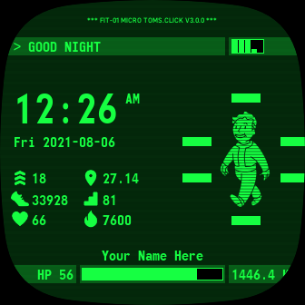
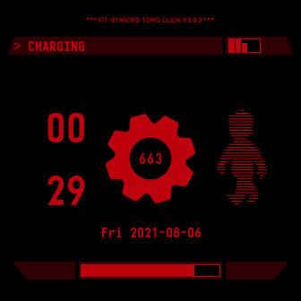

# Fit-Boy: Now available within the [Fitbit Gallery](https://gallery.fitbit.com/details/2d38820d-91d8-47a7-947f-0d8a12fa1cbe)!

## Description
A clock face for Fitbit Sense, modeled after the legendary Pip-Boy from the Fallout Series by Fallout Series by Bethesda. Built using the Fitbit Studio and Fitbit OS Simulator.

Welcome... to Vault 663.

## Target Devices:
- Fitbit Sense
- Fitbit Versa 3

## Requested Permissions:
- heart rate access (live bpm)
- activity (today's stats)
- user profile (weight)

## Features
- Vault Boy with limb health bars for the proper Pip-Boy feel
- You may type in your name to signify that you own this Fit-Boy

### Clock
- Supports both 12-hour and 24-hour format

### Date and Day Format
- DDD YYYY-MM-DD
    
### Stats
- Distance in kilometers
- Active zone in minutes
- Calories burn in kcal
- Elevation in floors
- Steps in... well... steps
- Heart rate in bpm
- Resting heart rate in the bottom left-hand corner, marked as HP
- Weight in the bottom right-hand corner, in kilograms
- Battery charge displayed instead of the LEVEL progress bar

### Color Schemes
- Fallout 4 (#16FF42)
- Fallout: New Vegas (#FFB641)
- Fallout 3 (#1AFF80)
- Lots of other colors

### "Console"
- Displays "> CHARGING ..." when charging
- Displays "> USER NOT DETECTED" when not on wrist
  - Also hides the vault boy and name
- Greets you
- Has that cool flashing cursor terminals in Fallout have
    
### WIP
- [x] Customizable name
- [x] More color schemes
- [x] Even more color schemes
- [x] Fix black screen on first run (no default color selected)
- [x] Add monofonto font
- [x] 12-hour format
- [x] 24-hour format
- [x] Translations
- [ ] ~~Potentially: Use the limb health bars as goal bars~~ Rejected: Battery Saving
  - [ ] ~~Active Zone Minutes~~
  - [ ] ~~Calories Burn~~
  - [ ] ~~Elevation~~
  - [ ] ~~Distance~~
  - [ ] ~~Steps~~
- [x] Use the bottom bar as total progress
- [ ] ~~Potentially:  GPS~~ Rejected: Battery Saving
    - [ ] ~~Latitude~~
    - [ ] ~~Longitude~~
    - [ ] ~~Heading~~
- [ ] Change picture based on the active zone and other factors
    - [ ] Make the vault boy animated
- [ ] Potentially:  Time till sunrise / sunset
- [ ] (Fitbit Permission Required) Always On Display
